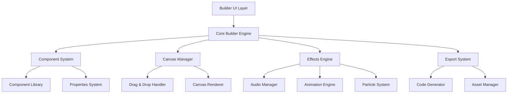

# Design Document

## Overview

The Spooky Web Builder is a browser-based drag-and-drop website builder with a Halloween theme, built using modern web technologies. The system consists of a visual editor interface, a component library system, a rendering engine for spooky effects, and export functionality. The architecture emphasizes modularity, performance, and immersive user experience through carefully crafted animations and audio integration.

## Architecture

### High-Level Architecture



### Technology Stack

- **Frontend Framework**: Vanilla JavaScript with Web Components for maximum performance and theme control
- **Drag & Drop**: HTML5 Drag and Drop API with custom ghost images
- **Animations**: CSS animations with Web Animations API for complex sequences
- **Audio**: Web Audio API for spatial audio effects and real-time processing
- **Graphics**: Canvas API for particle effects and custom rendering
- **Storage**: IndexedDB for project persistence and asset caching

## Components and Interfaces

### Core Builder Engine

```typescript
interface BuilderEngine {
  canvas: CanvasManager;
  componentLibrary: ComponentLibrary;
  effectsEngine: EffectsEngine;
  exportSystem: ExportSystem;
  
  initialize(): void;
  loadProject(projectId: string): Promise<Project>;
  saveProject(project: Project): Promise<void>;
  exportProject(format: ExportFormat): Promise<ExportResult>;
}
```

### Component System

#### Base Component Interface
```typescript
interface SpookyComponent {
  id: string;
  type: ComponentType;
  position: Position;
  dimensions: Dimensions;
  theme: HalloweenTheme;
  animations: AnimationConfig[];
  sounds: AudioConfig[];
  
  render(): HTMLElement;
  applyTheme(theme: HalloweenTheme): void;
  startAnimations(): void;
  playSound(trigger: SoundTrigger): void;
}
```

#### Component Categories

1. **Ghostly Headers**
   - Floating text with ethereal glow
   - Typewriter effects with supernatural timing
   - Dripping font animations

2. **Haunted Buttons**
   - Hover effects with color shifts and glowing
   - Click animations with screen shake
   - Supernatural sound triggers

3. **Spectral Forms**
   - Input fields with ghostly focus effects
   - Validation with spooky error messages
   - Floating label animations

4. **Phantom Images**
   - Fade-in/out effects
   - Parallax scrolling with depth
   - Glitch distortion filters

5. **Cursed Text**
   - Flickering text effects
   - Random character substitution
   - Haunted typography with shadows

### Canvas Manager

```typescript
interface CanvasManager {
  dragDropHandler: DragDropHandler;
  selectionManager: SelectionManager;
  gridSystem: GridSystem;
  
  addComponent(component: SpookyComponent, position: Position): void;
  removeComponent(componentId: string): void;
  moveComponent(componentId: string, newPosition: Position): void;
  selectComponent(componentId: string): void;
  getComponentAt(position: Position): SpookyComponent | null;
}
```

### Effects Engine

#### Animation System
```typescript
interface AnimationEngine {
  createFloatingAnimation(element: HTMLElement): Animation;
  createGlitchEffect(element: HTMLElement): Animation;
  createParticleSystem(config: ParticleConfig): ParticleSystem;
  createScreenShake(intensity: number): Animation;
}
```

#### Audio Manager
```typescript
interface AudioManager {
  loadSoundLibrary(): Promise<void>;
  playSound(soundId: string, options?: AudioOptions): void;
  createAmbientLoop(soundId: string): AudioLoop;
  applySpookyFilter(audioContext: AudioContext): AudioNode;
}
```

### Specialized Components

#### Retro Landing Page Sequence
```typescript
interface LandingPageSequence {
  phases: SequencePhase[];
  currentPhase: number;
  
  startSequence(): Promise<void>;
  skipToPhase(phaseIndex: number): void;
  pauseSequence(): void;
  resumeSequence(): void;
}

interface SequencePhase {
  duration: number;
  animations: AnimationConfig[];
  audio: AudioConfig[];
  interactions: InteractionConfig[];
  
  execute(): Promise<void>;
}
```

#### Cassette Player Component
```typescript
interface CassettePlayer extends SpookyComponent {
  currentTrack: AudioTrack;
  isPlaying: boolean;
  reelAnimation: Animation;
  
  play(): void;
  pause(): void;
  stop(): void;
  rewind(): void;
  fastForward(): void;
  eject(): void;
  flipTape(): void;
}
```

## Data Models

### Project Structure
```typescript
interface Project {
  id: string;
  name: string;
  createdAt: Date;
  updatedAt: Date;
  components: SpookyComponent[];
  globalTheme: HalloweenTheme;
  canvasSettings: CanvasSettings;
  exportSettings: ExportSettings;
}
```

### Theme System
```typescript
interface HalloweenTheme {
  name: string;
  colors: {
    primary: string;      // Deep black (#0a0a0a)
    secondary: string;    // Glowing orange (#ff6b35)
    accent: string;       // Ethereal purple (#8b5cf6)
    warning: string;      // Sickly green (#10b981)
    background: string;   // Dark gray (#1a1a1a)
    text: string;         // Ghostly white (#f8fafc)
  };
  fonts: {
    primary: string;      // Haunted serif
    secondary: string;    // Retro monospace
    accent: string;       // Dripping display font
  };
  effects: {
    glowIntensity: number;
    particleDensity: number;
    animationSpeed: number;
    audioVolume: number;
  };
}
```

### Audio Configuration
```typescript
interface AudioConfig {
  soundId: string;
  trigger: 'hover' | 'click' | 'load' | 'focus' | 'custom';
  volume: number;
  loop: boolean;
  delay: number;
  spatialAudio?: SpatialAudioConfig;
}

interface SpatialAudioConfig {
  position: Position3D;
  rolloffFactor: number;
  distanceModel: 'linear' | 'inverse' | 'exponential';
}
```

## Error Handling

### Error Categories

1. **Component Errors**
   - Invalid component configuration
   - Missing required properties
   - Theme application failures

2. **Audio Errors**
   - Failed to load sound files
   - Web Audio API not supported
   - Audio context suspended

3. **Animation Errors**
   - CSS animation failures
   - Performance degradation
   - Browser compatibility issues

4. **Export Errors**
   - Asset bundling failures
   - Code generation errors
   - File system access denied

### Error Display Strategy

All errors are displayed using the "Supernatural Disturbances" theme:
- Error messages appear in ghostly text with flickering effects
- Background shows subtle static or fog effects
- Error sounds include whispers or supernatural audio cues
- Recovery options presented as "Banish the Spirit" or "Seal the Rift"

## Testing Strategy

### Unit Testing
- Component rendering and theme application
- Audio system functionality
- Animation engine performance
- Drag and drop mechanics

### Integration Testing
- Full builder workflow (create, edit, export)
- Cross-browser compatibility
- Performance under load
- Audio synchronization with animations

### User Experience Testing
- Accessibility compliance with screen readers
- Keyboard navigation support
- Mobile responsiveness (touch interactions)
- Performance on lower-end devices

### Specialized Testing

#### Landing Page Sequence Testing
- Timing accuracy of 30-second sequence
- Audio synchronization with visual effects
- Interactive demo responsiveness
- Glitch effect performance

#### Cassette Player Testing
- Realistic mechanical animations
- Audio quality and ghost sound integration
- Control responsiveness
- Visual feedback accuracy

### Performance Benchmarks
- 60fps animation performance
- Audio latency under 50ms
- Component rendering under 100ms
- Export generation under 5 seconds for typical projects

## Implementation Considerations

### Browser Compatibility
- Modern browsers with Web Components support
- Graceful degradation for older browsers
- Progressive enhancement for advanced features

### Accessibility
- ARIA labels for all interactive elements
- Keyboard navigation support
- Screen reader compatibility
- High contrast mode support

### Performance Optimization
- Lazy loading of audio assets
- Component virtualization for large projects
- Animation frame throttling
- Memory management for particle systems

### Asset Management
- CDN delivery for audio files
- Sprite sheets for UI elements
- Compressed audio formats (WebM, OGG fallbacks)
- Optimized image formats (WebP with fallbacks)